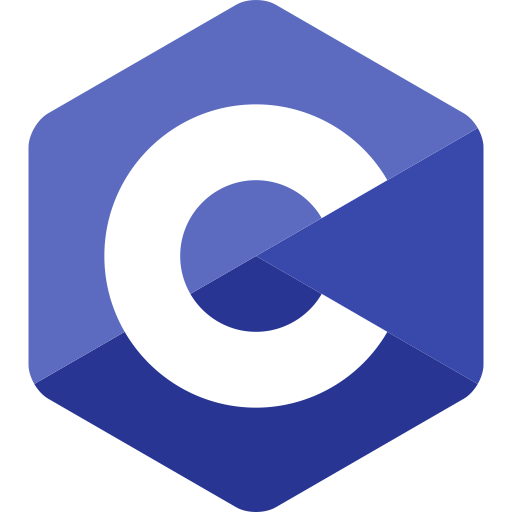
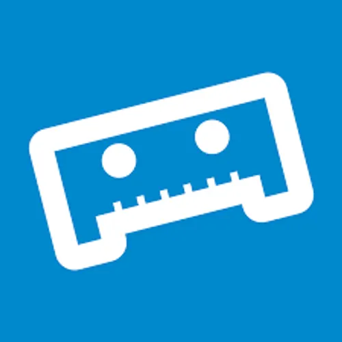
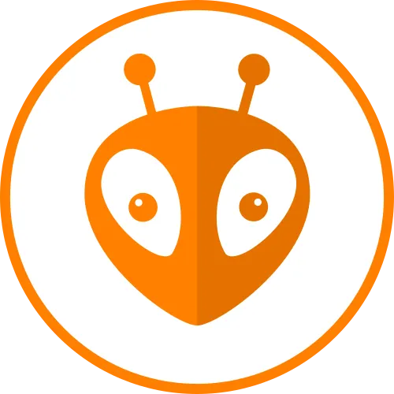
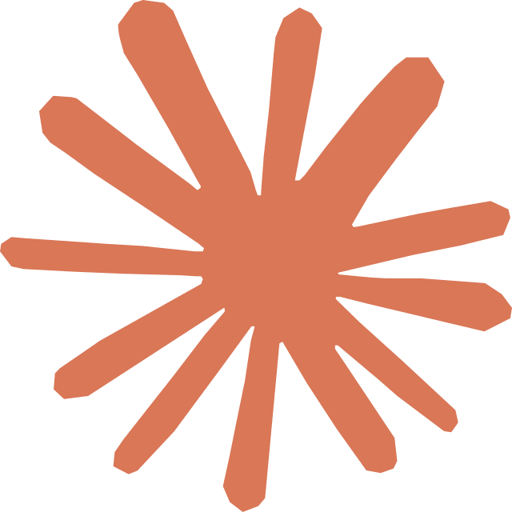

# Team Mehano

Student robotics and engineering team from **PGMEE Burgas, Bulgaria**.

We work on robotics, electronics, programming, automation.

---

## About Us

We are a student engineering team focused on building and competing with robots, electronics projects.

### Achievements

- **FIRST LEGO League Bulgaria Champions 2026**
- Qualified for the **FIRST LEGO League International Final in Greece**
- **3rd Place, FIRST LEGO League Bulgaria 2024**
- Multiple podium finishes in Bulgarian robotics and electronics competitions

---

## Languages

  
  
  
  

---

## Tools

  
  
  
  

---

## Contact

**Location:** Burgas, Bulgaria

**School:** PGMEE Burgas
